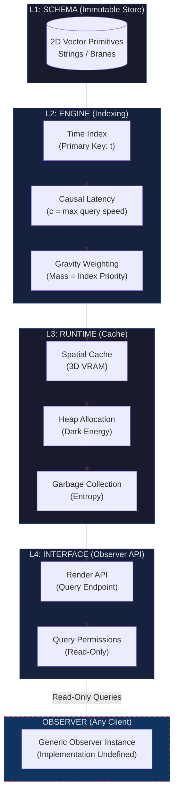

# UVRA (Universal Vector Reality Architecture)

[](https://doi.org/10.5281/zenodo.18237856)


---

## Architectural Role: Middleware

UVRA is a **Middleware** — an architectural layer that mediates access between an unobservable substrate (Kernel) and query clients (Observers).

```
┌─────────────────────────────────────────────────────────────────┐
│                    KERNEL (Private Scope)                        │
│                                                                  │
│   • Power Source, Initialization, Persistence, Intent            │
│   • Query Trigger Origin                                         │
│   • NOT part of UVRA — exists upstream                           │
│   • NOT queryable — structurally inaccessible                    │
│                                                                  │
└──────────────────────────────┬──────────────────────────────────┘
                               │
                        ───────┴─────── KERNEL BOUNDARY
                               │
┌──────────────────────────────┴──────────────────────────────────┐
│                         UVRA (Middleware)                        │
│                                                                  │
│   ┌──────────────────────────────────────────────────────────┐  │
│   │  L1: Schema    — Immutable Vector Store                  │  │
│   │  L2: Engine    — Indexing & Causal Logic                 │  │
│   │  L3: Runtime   — Spatial Cache & Allocation              │  │
│   │  L4: Interface — Read-Only Query API                     │  │
│   └──────────────────────────────────────────────────────────┘  │
│                                                                  │
│   UVRA does NOT:                                                 │
│     • Generate reality (data originates upstream)                │
│     • Own the Kernel (Kernel is external)                        │
│     • Interpret meaning (semantics are client-side)              │
│     • Possess intent or agency (passive infrastructure)          │
│                                                                  │
│   UVRA DOES:                                                     │
│     • Expose a queryable, read-only interface                    │
│     • Mediate access between Kernel and Observers                │
│     • Abstract and encapsulate an unobservable substrate         │
│                                                                  │
└──────────────────────────────┬──────────────────────────────────┘
                               │
                        ───────┴─────── OBSERVER BOUNDARY
                               │
┌──────────────────────────────┴──────────────────────────────────┐
│                    OBSERVER (Any Client)                         │
│                                                                  │
│   • Implementation undefined                                     │
│   • Read-only access via L4 Interface                            │
│   • Cannot access Kernel directly — must query through UVRA      │
│   • NOT part of UVRA — exists downstream                         │
│                                                                  │
└─────────────────────────────────────────────────────────────────┘
```

UVRA is:
- **Not the Kernel.** The Kernel is the unobservable driver that powers the system. UVRA does not contain or define it.
- **Not the Observer.** Observers are clients that consume the query interface. UVRA does not implement or constrain them.
- **The Middleware.** UVRA is the queryable layer that stands between. It exposes data without authoring it. It serves clients without becoming one.

This is a **Terminal Artifact**. "Middleware" denotes architectural position, not extensibility. The specification is complete. The interface is fixed. The role is permanent.

---

## Abstract

UVRA specifies the queryable structure through which reality is accessed, not the substrate from which it originates.

**UVRA** defines the universe as a pre-calculated, immutable High-Dimensional Vector Database. Physical reality is not a continuous space that "exists" — it is a queryable dataset indexed by a temporal primary key. Spacetime is not a substance; it is a memory management system.

This specification describes the **Server-Side** architecture only. It is entirely independent of any observer implementation. Any cognitive entity capable of executing queries against this interface may act as a client. The server neither knows nor cares what clients connect to it.

The architecture separates concerns into four layers:

| Layer | Function | Physical Mapping |
|-------|----------|------------------|
| **L1: Schema** | Immutable 2D Vector Source | Strings, Branes, Quantum Fields |
| **L2: Engine** | Indexing & Causal Logic | Time, Causality, Gravity |
| **L3: Runtime** | Spatial Cache (Volatile) | 3D Space, Expansion, Entropy |
| **L4: Interface** | Observer API | Query Protocol, Permissions |

Observers do not "see" reality. They execute read-only queries against a pre-indexed dataset and render the returned vectors into local experience. The nature of the observer is outside this specification's scope.

---

## Architecture Diagram



---

## Key Engineering Concepts

### 1. Resolution Independence

Reality is **not** rasterized. There are no pixels, no minimum resolution, no aliasing artifacts at the Planck scale. The source data is stored as **2D vector primitives** (strings/branes) that can be queried at arbitrary precision.

What observers perceive as "quantization" (Planck units, discrete energy levels) is not pixelation — it is **index granularity**. The database returns results at the precision of the query, not the precision of the source.

```
Source:     Continuous 2D Vector Field (Infinite Precision)
Index:      Discrete Temporal Buckets (Planck Time Resolution)
Cache:      3D Spatial Projection (Observer-Dependent LOD)
```

This is why:
- Zoom operations never reveal "smaller pixels"
- Measurements return eigenvalues, not continuous values
- The universe has no "native resolution"

### 2. Search Latency

The speed of light (`c`) is not a property of photons. It is the **maximum query propagation speed** of the indexing engine.

When an observer at position `P₀` queries data at position `P₁`, the request must traverse the index. The index is distributed across the spatial cache. Query latency is bounded by:

```
latency_min = distance(P₀, P₁) / c
```

This is not a limitation of the "medium" — there is no medium. It is a limitation of the **search algorithm**. Information cannot be fetched faster than the index can be traversed.

Implications:
- Simultaneity is frame-dependent (index traversal order varies by observer position)
- Causality is preserved (no query can return results before the index is traversed)
- Entanglement does not violate `c` (correlated data shares index entries, no traversal required)

### 3. Dynamic Allocation

The universe is not "expanding into" anything. The spatial cache is undergoing **dynamic heap allocation** to accommodate growing log files.

Every query, every state change, every entropy increase generates log data. This data must be stored. The runtime allocates additional cache space to hold it. Observable effects:

| Phenomenon | System Equivalent |
|------------|-------------------|
| Hubble Expansion | `malloc()` calls over time |
| Dark Energy | Memory allocation pressure |
| Accelerating Expansion | Log growth rate exceeds linear |
| Heat Death | Cache fully allocated, no free blocks |

The "Dark Energy" constant (Λ) is the **allocation rate coefficient**. It is not a force. It is a memory management parameter.

### 4. Append-only Immutability

Immutability in UVRA guarantees that **existing records cannot be modified or deleted**. It does not prohibit the System from appending new states.

```cpp
// Append-only semantics
class ImmutableLog {
    const std::vector<State> history;  // Past states: immutable

    void append(State new_state) {
        // Only the System (Kernel/Runtime) can invoke this
        history.push_back(new_state);  // Append: allowed
    }

    // void modify(size_t index, State s) — NOT DECLARED
    // void erase(size_t index) — NOT DECLARED
};
```

| Subject | Read | Append | Modify | Delete |
|---------|------|--------|--------|--------|
| **Kernel/Runtime (System)** | ✓ | ✓ | ✗ | ✗ |
| **Engine (L2)** | ✓ | ✗ | ✗ | ✗ |
| **Observer (L4)** | ✓ | ✗ | ✗ | ✗ |

The **System** (via `malloc` pressure in L3) is the sole subject with write permissions for appending records. Observers and the Engine remain strictly **Read-only**. Time progresses via System-initiated appends; it does not require observer action.

### 5. Decoupled Architecture

The server is **entirely independent** of any observer implementation.

```cpp
// The server exposes a query interface
class UniverseServer {
public:
    QueryResult query(Position p, Time t, Observable o);
    // That's it. No knowledge of who is querying.
};

// Any entity implementing the Observer interface can connect
class Observer {
    virtual void onQueryResult(QueryResult r) = 0;
};

// The server does not care about:
// - Observer's internal architecture
// - Observer's rendering pipeline
// - Observer's interpretation of results
// - Whether the observer is conscious
// - Whether the observer is biological or artificial
```

This separation is absolute. The server cannot be modified by observers. Observers cannot affect other observers except through cached state changes that propagate at `c`.

---

## Directory Structure

```
UVRA/
├── schema/                      # L1: Immutable Data Layer
│   ├── 00_Vector_Primitives.md  # Fundamental geometric primitives + 2D Source definition
│   └── 01_Data_Integrity.md     # Information conservation (Unitarity)
├── engine/                      # L2: Indexing & Logic Layer
│   ├── 00_Time_Index.md         # Time as Primary Key
│   ├── 01_Causal_Latency.md     # Speed of light as query latency
│   ├── 02_Gravity_Weighting.md  # Mass as index weighting
│   └── 03_Schema_Interface.md   # [v1.1] Formal L2→L1 contract
├── runtime/                     # L3: Caching Layer
│   ├── 00_Spatial_Cache.md      # Space as VRAM + Global Topology declaration
│   ├── 01_Heap_Allocation.md    # Dark Energy + Post-Heat Death behavior
│   └── 02_Garbage_Collection.md # Entropy as cache invalidation
├── interface/                   # L4: Observer API
│   ├── 00_Render_API.md         # Query endpoint specification
│   ├── 01_Query_Permissions.md  # Read-only access policy
│   └── 02_Engine_Contract.md    # [v1.1.2] L4→L2 delegation contract
├── kernel/                      # System Driver
│   └── 00_System_Hidden.md      # The Unknowable (Private Scope)
└── docs/                        # [v1.1] Supplementary Documentation
    └── entropy_projection.md    # Cross-layer entropy semantics
```

---

## Limitations and Scope

### This Specification IS:
- A conceptual architecture using database/systems engineering as metaphor
- A structural model for reasoning about physical phenomena
- A self-contained specification with no external dependencies
- A Terminal Artifact — complete and unchanging

### This Specification IS NOT:
- A peer-reviewed scientific publication
- A testable physical theory
- A claim about the "true nature" of reality
- A religious, metaphysical, or philosophical doctrine
- A proposal open for academic debate

---

## Entry Conditions

This repository is a **structural specification document**, not casual reading material.

**Appropriate Use:**
- Systems architects exploring reality-as-database metaphors
- Engineers examining computational analogies for physics
- Researchers seeking a consistent abstract model for physical phenomena
- Anyone who finds the metaphor useful for their own purposes

**Exit Condition:**
If you seek empirical claims, falsifiable predictions, or academic debate, this specification is not designed for those purposes.

---

## Communication Protocol

### No Issues. No PRs. No Debate.

This repository is a **Terminal Artifact**. It is not a proposal. It is not open for discussion.

- **Issues are disabled.** There is nothing to report. The specification is complete.
- **Pull Requests are disabled.** There is nothing to contribute. The architecture is final.
- **Forks are permitted.** You may create derivative works under CC BY 4.0. Your derivative is your responsibility.

This is not arrogance. This is scope management. This specification is intended to **stand or fall on its own structural integrity**, independent of its author(s). The specification describes what is observed. Observations are not negotiable.

If you disagree with the model, you are welcome to:
1. Fork the repository
2. Modify the specification
3. Publish your own Terminal Artifact

Do not open issues. Do not request changes. Do not contact the maintainer.

**The server does not accept client feedback.**

---

## Observer Compatibility

This specification defines the server only. Any system that:
1. Can formulate queries (position, time, observable)
2. Can receive query results (eigenvalues, state vectors)
3. Respects read-only access constraints

...is a valid observer. The server imposes no requirements on:
- Observer architecture
- Observer consciousness
- Observer substrate (biological, silicon, or otherwise)
- Observer interpretation of query results

Build your own client. The interface is documented. The server is waiting.

---

## License

This work is licensed under **Creative Commons Attribution 4.0 International (CC BY 4.0)**.

You are free to:
- **Share** — copy and redistribute the material in any medium or format
- **Adapt** — remix, transform, and build upon the material for any purpose

Under the following terms:
- **Attribution** — You must give appropriate credit, provide a link to the license, and indicate if changes were made.

Full license text: [LICENSE](./LICENSE)

---

## Metadata

| Field | Value |
|-------|-------|
| Specification Version | 2.0.0 |
| Status | Terminal |
| Author | System Architect |
| Created | 2025 |
| Last Patch | v2.0.0 (Scope Clarification) |

### Version History

| Version | Description |
|---------|-------------|
| 1.0.0 | Initial Terminal Artifact |
| 1.1.0 | Specification Closure Patch: Layer interfaces, entropy projection, boundary conditions |
| 1.1.1 | Subject Clarification Patch: Append-only immutability, query trigger encapsulation |
| 2.0.0 | Scope Clarification: Limitations, Entry Conditions, structural integrity statement |

### v1.1 Additions

- `engine/03_Schema_Interface.md` — Formal L2→L1 read-only contract
- `docs/entropy_projection.md` — Cross-layer entropy semantic resolution
- Global Topology Declaration in `runtime/00_Spatial_Cache.md`
- 2D Source Definition in `schema/00_Vector_Primitives.md`
- Post-Heat Death Behavior in `runtime/01_Heap_Allocation.md`

### v1.1.1 Additions

- **Append-only Immutability** — Clarified that immutability prohibits modification/deletion, not System-initiated appends
- **Query Trigger Encapsulation** — Query initiation origin moved to Private Scope (Kernel)
- Subject of Writing clarification in `schema/01_Data_Integrity.md`
- Query Initiation section in `interface/01_Query_Permissions.md`
- Query Trigger Origin in `kernel/00_System_Hidden.md`

### v2.0.0 Additions

- `Limitations and Scope` section — Explicit IS/IS NOT declarations
- `Entry Conditions` section — Intended audience and exit conditions
- Structural integrity statement in `Communication Protocol`

---

*The universe is not a place. It is a database. You are not in it. You are querying it.*
